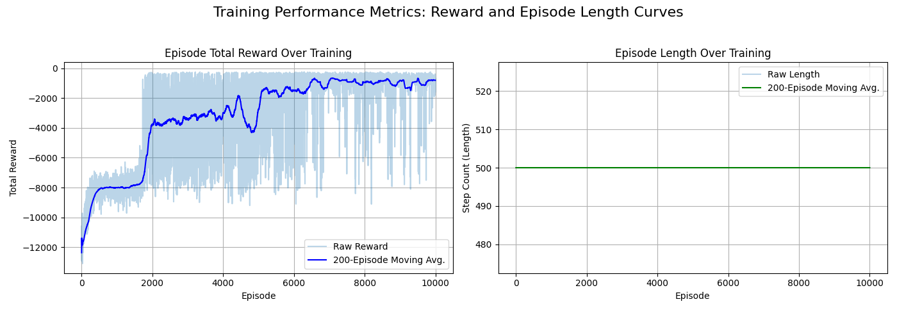
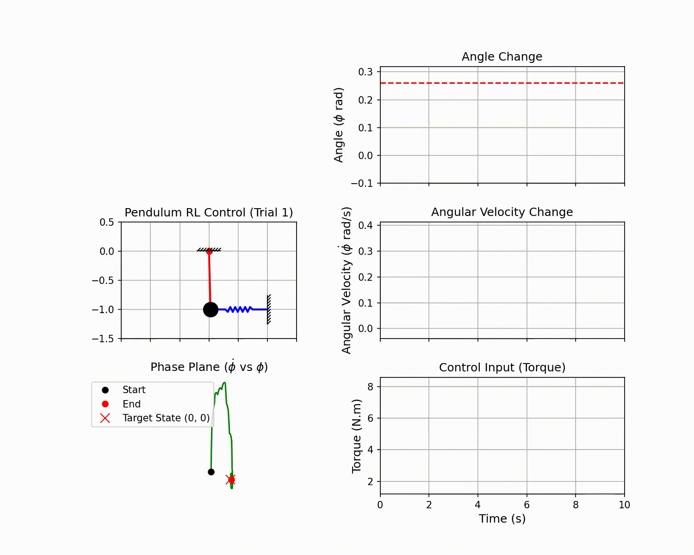
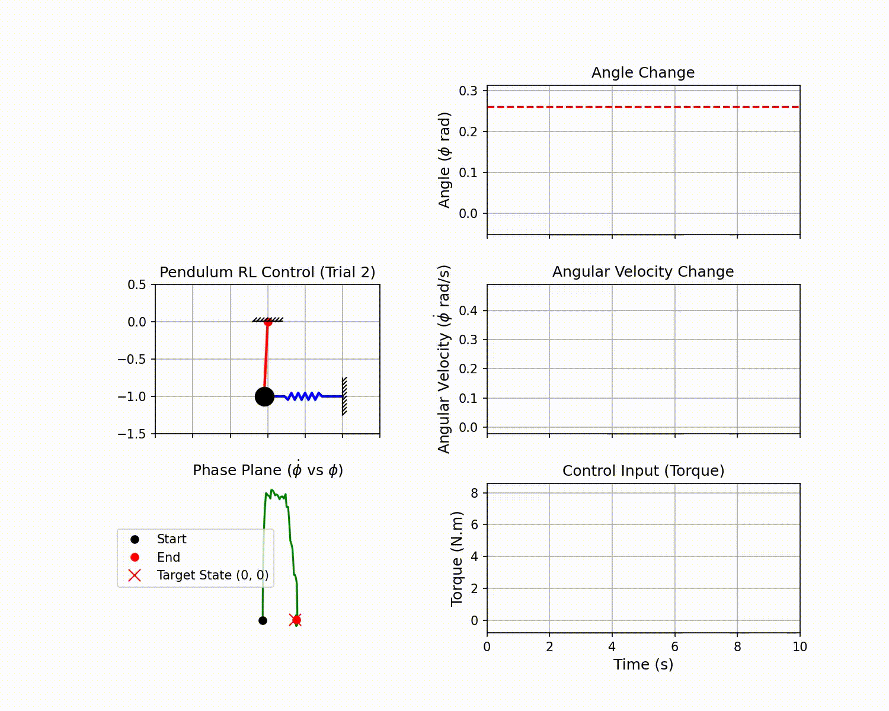

# Q-Learning Stabilization of a Spring-Mass Inverted Pendulum

This repository documents the implementation of a **Q-Learning agent** for stabilizing a linearized, spring-mass inverted pendulum model at a specific **non-zero reference angle ($\phi_{ref} = \pi/12$ rad)**.

The project utilizes a discretized state-space approach with a cost-sensitive reward function to train an optimal control policy for this complex system.

## 1. System Model and Parameters

The `PendulumSystemEnv` class implements a linearized state-space representation of a pendulum with an attached spring and damper. The state vector is $\mathbf{x} = [\phi, \dot{\phi}]^T$.

| Parameter | Symbol | Value | Unit |
| :--- | :--- | :--- | :--- |
| Rod Mass | $\mathbf{m}$ | $0.5$ | $kg$ |
| Rod Length | $\mathbf{L}$ | $1.0$ | $m$ |
| End Mass | $\mathbf{M}$ | $1.5$ | $kg$ |
| Spring Constant | $\mathbf{k}$ | $10.0$ | $N/m$ |
| Damping Coeff. | $\mathbf{b}$ | $2.0$ | $N.m.s/rad$ |
| Gravity | $\mathbf{g}$ | $9.81$ | $m/s^2$ |
| **Reference Angle** | $\mathbf{\phi_{ref}}$ | $\pi/12 \approx 0.2618$ | $rad$ |
| Time Step | $\mathbf{\Delta t}$ | $0.02$ | $s$ |

## 2. Theoretical Foundations of Q-Learning

Q-Learning is a model-free, off-policy reinforcement learning algorithm used to find an optimal action-selection policy for any given Markov Decision Process (MDP). The core of the algorithm is the **Q-function** (or action-value function), $Q(s, a)$, which estimates the maximum expected future reward achievable by taking action $a$ in state $s$.

### 2.1. The Bellman Optimality Equation

The optimal Q-function, $Q^*(s, a)$, must satisfy the Bellman Optimality Equation, which states that the value of a state-action pair is the immediate reward plus the discounted maximum expected future reward from the next state:

$$Q^*(s, a) = R(s, a) + \gamma \max_{a'} Q^*(s', a')$$

Where:
* $s$: Current state (e.g., $[\phi, \dot{\phi}]$).
* $a$: Action taken (e.g., $\tau$).
* $R(s, a)$: Immediate reward received after taking action $a$ in state $s$.
* $\gamma$: Discount factor, which determines the importance of future rewards ($0 \le \gamma \le 1$).
* $s'$: Next state.
* $a'$: Next action.

### 2.2. The Q-Learning Update Rule

In Q-Learning, the agent iteratively updates its estimate of $Q(s, a)$ using the following formula, which incrementally moves the current estimate toward the optimal value defined by the Bellman Equation:

$$Q(s, a) \leftarrow Q(s, a) + \alpha [R(s, a) + \gamma \max_{a'} Q(s', a') - Q(s, a)]$$

Where:
* $\alpha$: Learning rate ($0 < \alpha \le 1$), which dictates how much the new information overrides the old information.
* The term $[R(s, a) + \gamma \max_{a'} Q(s', a') - Q(s, a)]$ is the **Temporal Difference (TD) Error**, representing the difference between the estimated future reward (Target) and the current Q-value (Estimate). 

### 2.3. Optimal Policy Derivation

Once the Q-table is sufficiently trained and converges to $Q^*$, the optimal control policy $\pi^*$ is derived by selecting the action that maximizes the Q-value for any given state:

$$\pi^*(s) = \arg\max_{a} Q(s, a)$$

## 3. Q-Learning Implementation (`FastPendulumControl`)

The control policy is learned via the Q-Learning algorithm, which operates on discretized state and action spaces using the `FastPendulumControl` class.

### 3.1. State and Action Space Discretization

The environment is discretized for Q-Learning:

* **State Space**: A Q-table of size $51 \times 51$:
    * Angle ($\phi$): $50$ bins across $[-\pi/3, \pi/3]$ rad.
    * Angular Velocity ($\dot{\phi}$): $50$ bins across $[-3.0, 3.0]$ rad/s.
* **Action Space**: The continuous torque input is discretized into $101$ actions:
    * Torque ($\mathbf{\tau}$): Values from $[-10.0, 10.0]$ N.m, with $0.2$ N.m steps.

### 3.2. Reward Function

The reward function (a negative cost function) is crucial for penalizing angular error and control effort:

$$R = -20.0 \cdot |\phi - \phi_{ref}| - \lambda_{\tau} \cdot \tau^2 - \lambda_{\Delta \tau} \cdot (\Delta \tau)^2$$

* **$\lambda_{\tau}$ (Torque Penalty)**: $0.005$
* **$\lambda_{\Delta \tau}$ (Torque Change Penalty)**: $0.25$

These weights were specifically tuned to overcome a persistent steady-state error, allowing the agent to use the necessary torque to hold the non-zero reference angle.

## 4. Training Workflow and Hyperparameter Search

The `hyperparameter_search()` function orchestrates the entire training and analysis process, including the initial search and extended training.

### 4.1. Hyperparameter Search Phase

1.  A grid search is performed over initial combinations of the learning rate ($\alpha$) and discount factor ($\gamma$):
    * `alphas`: $[0.15, 0.20]$
    * `gammas`: $[0.95, 0.99]$
    * `epsilons`: $[1.0]$
    * `epsilon_decays`: $[0.995, 0.999]$
    * `min_epsilons`: $[0.01]$
2.  Each combination is trained for **$2,000$ episodes**.
3.  The best agent is selected based on the highest mean reward over $3$ test episodes.

### 4.2. Extended Training and Final Analysis

The best hyperparameters are used for an **extended training run of $10,000$ episodes** to generate the final policy.

#### Learning Curve Visualization

The performance metrics (Total Reward and Episode Length) are plotted over the 10,000 training episodes, demonstrating the agent's convergence toward an optimal policy.

<p align="center">
  
</p>

## 5. Expected Performance Metrics

The fine-tuning of the reward function aims for superior control performance:

| Metric | Description | Expected Result | Unit |
| :--- | :--- | :--- | :--- |
| **Steady-State Error** | Final average absolute deviation from $\phi_{ref}$ | **$\approx 0.000$** | $rad$ |
| Maximum Overshoot | Max deviation beyond $\phi_{ref}$ | $\mathbf{\approx 0.0}$ | $rad$ |
| Settling Time (5% tol) | Time to settle within $0.05$ rad of $\phi_{ref}$ | $< 1.0$ | $s$ |

## 6. Visualization of Control Response

The `animate_pendulum()` function generates control response plots (Angle, Torque, Phase Plane) and a real-time animation of the pendulum's stabilization at the reference angle ($\phi_{ref} = \pi/12$ rad).

### Trial 1: Control Response and Animation

This trial shows the system rapidly converging from a small initial perturbation to the reference angle.

<p align="center">
  
</p>

### Trial 2: Control Response and Animation

This second trial confirms the robustness of the trained policy under different initial conditions.

<p align="center">
  
</p>

## 7. How to Run the Code

### Requirements

* Python 3.9+
* `numpy`, `matplotlib`, `pandas`
* **FFmpeg (Optional)**: Required to save the animation as an `.mp4` video file.

The entire process, including hyperparameter search, extended training, and analysis, is executed by running the script directly:

```bash
python pendulum_Q_Learning.py