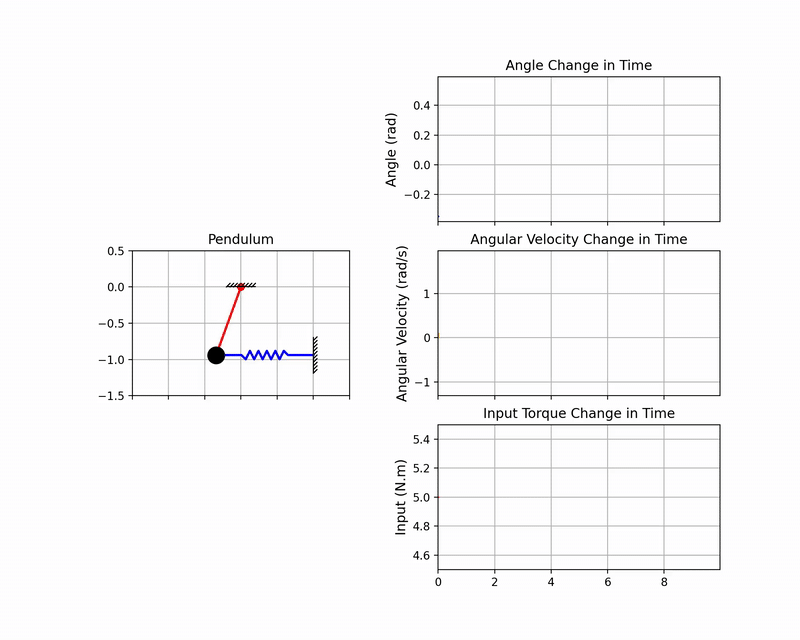
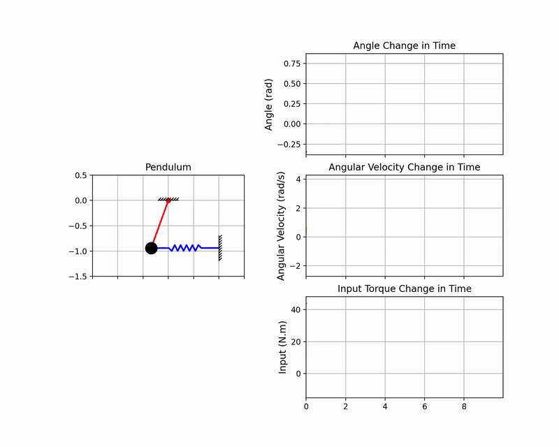
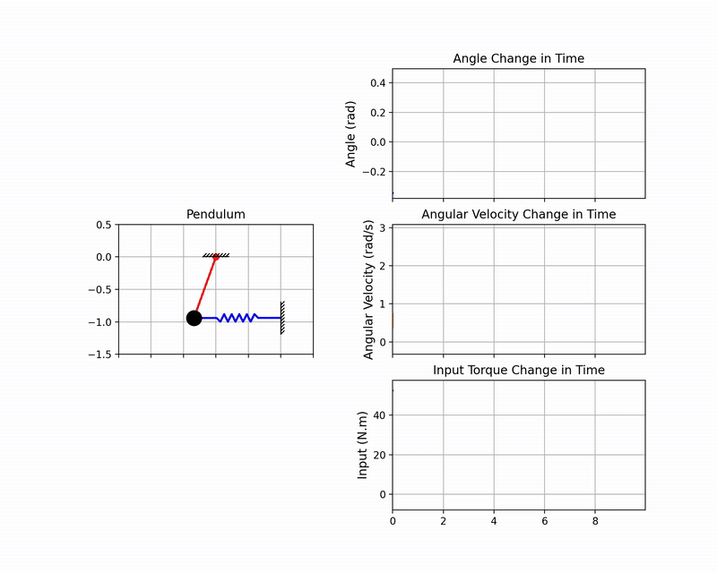

# Dynamic Analysis and PID Control of the Spring-Mass Inverted Pendulum

This repository documents the mathematical modeling, dynamic simulation, and **stabilization efforts using a Proportional-Integral-Derivative (PID) controller** for a spring-mass inverted pendulum. The model is linearized around the unstable equilibrium point, solved numerically, and visualized in real-time.

## 🚀 Simulation Visuals

The dynamic response of the system under different external torque inputs ($\tau$) and PID control signals is shown below. These animations demonstrate the system's behavior governed by the derived state-space equations and the effect of the controller.

| Sinusoidal Input Response with Initial Angle | Step Input Response with Initial Angle|
| :---: | :---: |
|  |  |

| PID Controller Response #1 | PID Controller Response #2 |
| :---: | :---: |
|  |  |

---

## 1. System Parameters

The model consists of a rigid rod ($m, L$), a point mass ($M$) at the end, a linear spring ($k$), and damping ($b$) at the pivot.

| Parameter | Symbol | Description | Unit |
| :--- | :--- | :--- | :--- |
| Rod Mass | $\mathbf{m}$ | Mass of the rigid rod | $kg$ |
| Rod Length | $\mathbf{L}$ | Length of the rod | $m$ |
| Point Mass | $\mathbf{M}$ | Point mass at the end | $kg$ |
| Spring Constant | $\mathbf{k}$ | Linear spring constant | $N/m$ |
| Damping Coeff. | $\mathbf{b}$ | Damping at the pivot | $N.m.s/rad$ |
| Angle | $\mathbf{\phi}$ | Angular Position from Vertical | $rad$ |

## 2. Mathematical Model Derivation

The equations of motion are derived using **Newton's Second Law for Rotation** around the pivot point O: $\sum\tau_{0}=I_{0}\ddot{\varphi}$. Counter-clockwise (CCW) rotation and torques are defined as positive.

### 2.1. Total Moment of Inertia ($I$)

The total moment of inertia ($I$) about the pivot O is the sum of the rod's inertia ($I_{rod}$) and the point mass's inertia ($I_{point\ mass}$).

1.  **Rod's Inertia ($I_{rod}$):** Calculated via integration from 0 to L.
    $$I_{rod} = \frac{1}{3}mL^{2}$$
2.  **Point Mass Inertia ($I_{point\ mass}$):** Since the point mass is attached at $L$, the inertia is calculated using the parallel axis theorem.
    $$I_{point\ mass} = ML^{2}$$
3.  **Total Moment of Inertia ($I$):**
    $$I = \left(\frac{1}{3}m+M\right)L^{2}$$

### 2.2. Calculation of Torques

Four major torques act on the system:

1.  **External Input Torque ($\tau_{input}$):** Positive as defined in the CCW direction.
    $$\tau_{input} = +\tau(t)$$
2.  **Damping Torque ($\tau_{b}$):** Always opposes motion.
    $$\tau_{b} = -b\dot{\varphi}$$
3.  **Gravity Torque ($\tau_{g}$):** Acts on the centers of gravity of the rod (at $L/2$) and the point mass (at $L$).
    $$\tau_{g} = -\left(mg\frac{L}{2}\sin(\varphi)+MgL\sin(\varphi)\right) = -gL\left(\frac{m}{2}+M\right)\sin(\varphi)$$
4.  **Spring Torque ($\tau_{k}$):** The spring force $F_{k}$ is $k$ times the horizontal displacement $x = L\cos(\varphi)$. The moment arm is $L\sin(\varphi)$.
    $$\tau_{k} = -F_k \cdot (Moment\ Arm) = -\left(kL\cos(\varphi)\right) \cdot \left(L\sin(\varphi)\right)$$
    $$\tau_{k} = -kL^{2}\sin(\varphi)\cos(\varphi)$$

### 2.3. Non-Linear Equation of Motion

Summing the torques gives the non-linear equation:
$$I\ddot{\varphi}=\tau-b\dot{\varphi}-gL\left(\frac{m}{2}+M\right)\sin(\varphi)-kL^{2}\sin(\varphi)\cos(\varphi)$$

## 3. Jacobian Linearization

To use linear system theory, the system is linearized around the unstable equilibrium point ($\phi=0, \dot{\phi}=0$).

### 3.1. Non-Linear State Equations

The state vector is defined as
$$
x=\begin{bmatrix}x_{1}\\ x_{2}\end{bmatrix}=\begin{bmatrix}\varphi\\ \dot{\varphi}\end{bmatrix}
$$

The non-linear state equations
$$
\dot{x}=h(x,u)=\begin{bmatrix}h_{1}\\ h_{2}\end{bmatrix}
$$

$$h_{1}=\dot{x}_{1}=x_{2}$$

$$h_{2}=\dot{x}_{2}=\frac{1}{I}\left[\tau-b\dot{\varphi}-gL(\frac{m}{2}+M)\sin(\varphi)-kL^{2}\sin(\varphi)\cos(\varphi)\right]$$

### 3.2. Calculation of Jacobian Matrices $A$ and $B$

The linearized system is $\dot{\tilde{x}}=A\tilde{x}+B\tilde{u}$.

**State Matrix ($A$) Calculation:**
$$
A=\left.\frac{\partial h}{\partial x}\right|_{x_{0}}
$$

* $A_{11}=\frac{\partial h_{1}}{\partial x_{1}} = 0$
* $A_{12}=\frac{\partial h_{1}}{\partial x_{2}} = 1$
* $A_{21}=\frac{\partial h_{2}}{\partial x_{1}}$: This is calculated by differentiating the angle-dependent terms, $\frac{\partial}{\partial x_{1}}[\dots]$, and evaluating at $\varphi=0$ ($\cos(0)=1, \sin(0)=0$).
    $$A_{21}=-\frac{gL(\frac{m}{2}+M)+kL^{2}}{I}$$
* $A_{22}=\frac{\partial h_{2}}{\partial x_{2}}$: This is calculated by differentiating the damping term.
    $$A_{22}=-\frac{b}{I}$$

**Input Matrix ($B$) Calculation:**
$$
B=\left.\frac{\partial h}{\partial u}\right|_{x_{0}u_{0}}
$$

* $B_{1}=\frac{\partial h_{1}}{\partial u} = 0$
* $B_{2}=\frac{\partial h_{2}}{\partial u} = \frac{1}{I}$

### 3.3. Final Linear State-Space Representation

The final linearized dynamics are:

$$\begin{bmatrix}\dot{\varphi}\\ \ddot{\varphi}\end{bmatrix} = \begin{bmatrix}0 & 1 \\ -\frac{gL(\frac{m}{2}+M)+kL^{2}}{(\frac{1}{3}m+M)L^{2}} & -\frac{b}{(\frac{1}{3}m+M)L^{2}}\end{bmatrix} \begin{bmatrix}\varphi\\ \dot{\varphi}\end{bmatrix} + \begin{bmatrix}0\\ \frac{1}{(\frac{1}{3}m+M)L^{2}}\end{bmatrix}\tau$$

## 4. Simulation Implementation

### Numerical Method
The state-space model is solved numerically using the **Euler Forward Integration Method** ($\mathbf{X}_{k+1} = \mathbf{X}_k + \mathbf{\dot{X}}_k \cdot \Delta t$) for a fast, time-domain response. **This same method forms the basis for the numerical integration and differentiation used within the PID control loop.**

### Controller Design (PID)
To stabilize the system and ensure it reaches and maintains a desired angular position ($\phi_{target}$), a **PID controller** was implemented. The control torque ($\tau_{PID}$) is calculated based on the error signal between the target angle and the current angle:

$$\tau_{PID} = K_P \cdot e(t) + K_I \cdot \int e(t) dt + K_D \cdot \frac{de(t)}{dt}$$

The controller utilizes numerical approximations for its terms:
* **Integral Term ($I$):** Calculated using the **Left Rectangular Method** (Forward Euler integration): $\int e(t) dt \approx \sum e_k \cdot \Delta t$.
* **Derivative Term ($D$):** Calculated using the **Forward Difference Method** (Forward Euler): $\frac{de(t)}{dt} \approx \frac{e_k - e_{k-1}}{\Delta t}$.

### Simulation Parameters
The simulation uses the following physical parameter values:

| Parameter | Symbol | Value | Unit |
| :--- | :--- | :--- | :--- |
| Rod Mass | $m$ | $0.5$ | $kg$ |
| Rod Length | $L$ | $1.0$ | $m$ |
| Point Mass | $M$ | $1.5$ | $kg$ |
| Spring Constant | $k$ | $10.0$ | $N/m$ |
| Damping Coeff. | $b$ | $2.0$ | $N.m.s/rad$ |
| Gravity | $g$ | $9.81$ | $m/s^2$ |

### Visualization
The Python script utilizes Matplotlib's `FuncAnimation` to generate a live visualization, combining the physical movement of the pendulum with the time-domain plots of the state variables ($\phi$, $\dot{\phi}$) and the Input Torque ($\tau$). Notably, the spring's dynamic behavior (stretching/compressing and rotation) is achieved using **affine transformations (scaling and rotation)** applied to a predefined spring geometry, which is an advanced technique for kinematic visualization.

---
## Controller Tuning Methodology

For detailed information on how the PID gains ($\mathbf{K_P, K_D, K_I}$) were theoretically calculated using the **Pole Placement** technique, including the target performance parameters ($\zeta, \omega_n, \alpha$) and the resulting symbolic/numerical solutions, please refer to the dedicated tuning folder.

* **[PID Tuning Details and MATLAB Code (Pole Placement)](/pid_tuning)**

## 5. How to Run the Code

### Requirements

* Python 3.9.13 >
* `numpy`, `matplotlib`
* **FFmpeg (Optional):** Required only if you choose to export the animation as an `.mp4` video file.

### Execution Steps

1.  Install the necessary libraries:
    ```bash
    pip install numpy matplotlib
    ```
2.  Run the main simulation script (`pendulum_simulation.py`):
    ```bash
    python pendulum_simulation.py
    ```

---