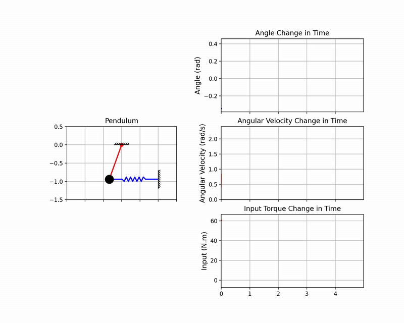

# ⚙️ PID Tuning - Pole Placement Method

This `README.md` details the theoretical calculation of the Proportional-Integral-Derivative (PID) controller gains ($K_P, K_D, K_I$) used for the stabilization of the spring-mass inverted pendulum system.

### 1. File Purpose

The file **`pid_tuning_matlab.mlx`** in this folder contains the MATLAB/Symbolic Math code used to calculate the PID gains via the **Pole Placement** technique, ensuring the closed-loop system exhibits the desired dynamic response characteristics.

### 2. Mathematical Basis

#### 2.1. State-Space Representation

The linearized dynamics of the system are represented in the standard state-space form:

$$\mathbf{\dot{x}}(t) = \mathbf{A}\mathbf{x}(t) + \mathbf{B}\mathbf{\tau}(t)$$
$$\mathbf{y}(t) = \mathbf{C}\mathbf{x}(t) + \mathbf{D}\mathbf{\tau}(t)$$

where $\mathbf{x} = [\varphi, \dot{\varphi}]^T$, $\mathbf{\tau}$ is the input torque, and $\mathbf{y} = [\varphi]$ is the angular position output.

#### 2.2. Transfer Function Derivation (From State-Space)

The transfer function $G(s)$, which relates the input torque $\mathbf{\tau}(s)$ to the output angle $\mathbf{Y}(s)$ in the Laplace domain, is derived by applying the Laplace Transform to the state-space equations.

1.  **Transforming the State Equation (Assuming zero initial conditions):**

    $$s\mathbf{X}(s) = \mathbf{A}\mathbf{X}(s) + \mathbf{B}\mathbf{\tau}(s)$$

2.  **Solving for the State Vector $\mathbf{X}(s)$:**

    $$(s\mathbf{I} - \mathbf{A})\mathbf{X}(s) = \mathbf{B}\mathbf{\tau}(s)$$
    $$\mathbf{X}(s) = (s\mathbf{I} - \mathbf{A})^{-1}\mathbf{B}\mathbf{\tau}(s)$$

3.  **Substituting $\mathbf{X}(s)$ into the Output Equation:**

    $$\mathbf{Y}(s) = \mathbf{C}\mathbf{X}(s) + \mathbf{D}\mathbf{\tau}(s)$$
    $$\mathbf{Y}(s) = \mathbf{C}(s\mathbf{I} - \mathbf{A})^{-1}\mathbf{B}\mathbf{\tau}(s) + \mathbf{D}\mathbf{\tau}(s)$$

4.  **Final Transfer Function:**

    The transfer function $\mathbf{G}(s)$ is defined as $\mathbf{Y}(s) / \mathbf{\tau}(s)$:

    <ins>**$$\mathbf{G}(s) = \mathbf{C}(s\mathbf{I} - \mathbf{A})^{-1}\mathbf{B} + \mathbf{D}$$**</ins>

This formula is numerically and symbolically calculated using MATLAB based on the system's $\mathbf{A, B, C, D}$ matrices to find the explicit form $G(s) = \Phi(s) / \mathbf{\tau}(s)$.

### 3. Methodology: Pole Placement

The PID gains are derived by matching the characteristic equation of the closed-loop system with a target polynomial whose roots (poles) are strategically placed to achieve desired performance specifications.

#### 3.1. Desired Characteristic Polynomial

For the resulting third-order closed-loop system, the desired characteristic polynomial $\mathbf{P_{desired}(s)}$ is defined:

$$\mathbf{P_{desired}(s)} = (s^2 + 2\zeta\omega_n s + \omega_n^2) (s + \alpha\omega_n)$$

#### 3.2. Symbolic Solution

The MATLAB code solves the system of equations resulting from equating the coefficients of the actual and desired characteristic polynomials after forming the Closed-Loop Characteristic Equation: $\mathbf{1 + PID(s) \cdot G(s) = 0}$.

### 4. Sample Target Parameters and Calculated Gains

| Parameter Type | Symbol | Value |
| :--- | :--- | :--- |
| **Performance ($\zeta, \omega_n, \alpha$)** | Damping Ratio ($\zeta$) | $1.5$ |
| | Natural Frequency ($\omega_n$) | $2.0$ $rad/s$ |
| | Fast Pole Multiplier ($\alpha$) | $5.0$ |
| **PID Gains ($K_P, K_D, K_I$)** | Proportional Gain ($\mathbf{K_P}$) | **79.4992** |
| | Derivative Gain ($\mathbf{K_D}$) | **24.6667** |
| | Integral Gain ($\mathbf{K_I}$) | **66.6667** |

---

## 5. Verification Visuals

The following animation demonstrates the system's stable response when controlled by the PID gains calculated using the Pole Placement method to reach a target angle ($\phi_{target} = 0.4$ rad).

| Tuned PID Controller Response |
| :---: |
|  |

---

### 6. How to Run the Tuning Script

1.  Ensure you have **MATLAB** and the **Symbolic Math Toolbox** installed.
2.  Run the **`pid_tuning_matlab.mlx`** file in the MATLAB environment.
3.  The script will display the symbolic formulas, the final numerical gains, and a verification of the achieved closed-loop pole locations.